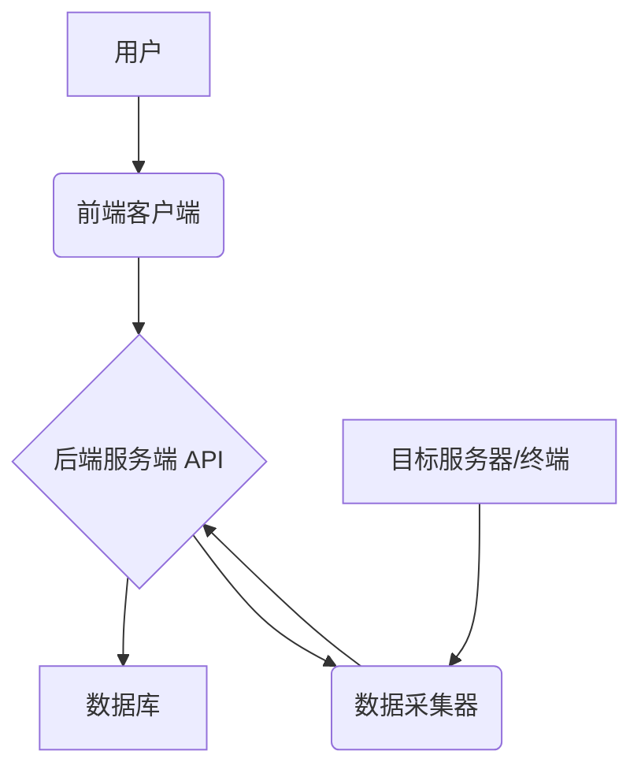

# 系统架构设计

## 1. 概述

本平台旨在解决内部协作痛点，打通研发生命周期流程，集中管理关键信息，并提供统一的基础能力接口。系统部署于公司局域网内。

参考需求: `requirements.md`

## 2. 高层架构

采用**客户端-服务端 (Client-Server)** 架构，并包含一个可选的**数据采集器 (Data Collector)** 组件。

*   **前端客户端 (Frontend Client)**: 用户交互界面，提供 Web 或桌面形态。
*   **后端服务端 (Backend Server)**: 核心业务逻辑处理，提供 API 接口，与数据库交互。
*   **数据库 (Database)**: 持久化存储所有业务数据。
*   **数据采集器 (Data Collector)**: (可选，V1.1 或之后引入) 部署在目标服务器/终端，用于收集信息或辅助执行任务。

[待补充: 可以考虑使用 Mermaid 或 PlantUML 语法绘制一个简单的架构图，展示组件交互]

## 3. 组件职责

*   **前端客户端**: 负责用户界面展示、用户输入处理、向后端请求数据和提交操作。
*   **后端服务端**: 实现所有业务逻辑（权限控制、数据校验、流程处理）、管理数据库连接、提供 RESTful API 接口、与数据采集器通信（如果启用）。
*   **数据库**: 存储用户信息、环境、资产、服务、业务、需求、配置、Bug、审计日志等。
*   **数据采集器**: 按需收集目标机器信息（配置、日志、状态）、响应服务端指令。

## 4. 关键交互流程

*   **用户登录**: 客户端 -> 服务端 (认证) -> 数据库 (用户信息校验)
*   **数据查询 (如查看环境列表)**: 客户端 -> 服务端 (权限校验) -> 数据库 -> 服务端 (数据处理) -> 客户端
*   **Bug 报告提交**: 客户端 (表单) -> 服务端 (数据校验、关联信息处理、权限校验) -> 数据库 (存储 Bug 信息)
*   **日志获取 (启用采集器)**: 客户端 (请求) -> 服务端 (定位环境/服务/资产/采集器) -> 采集器 (执行获取) -> 服务端 (中转) -> 客户端

## 5. 技术选型概览

[细节见 `technology_stack.md`]
*   后端: Go (Gin)
*   前端: [待定，如 Next.js (TypeScript) + UI库 (如 Ant Design / Material UI)]
*   数据库: [待定，倾向于关系型数据库，如 PostgreSQL / MySQL]
*   数据采集器: [待定，如 Go / Python]

## 6. 非功能性考虑

*   **可扩展性**: 后端服务考虑采用模块化设计，便于功能扩展。数据库设计考虑未来数据量增长。
*   **可用性**: 服务端可考虑无状态设计，便于水平扩展和冗余部署。数据库需考虑备份和恢复策略。
*   **安全性**: 局域网部署，但仍需严格的认证授权、API 接口防护、通信加密（特别是采集器）。 