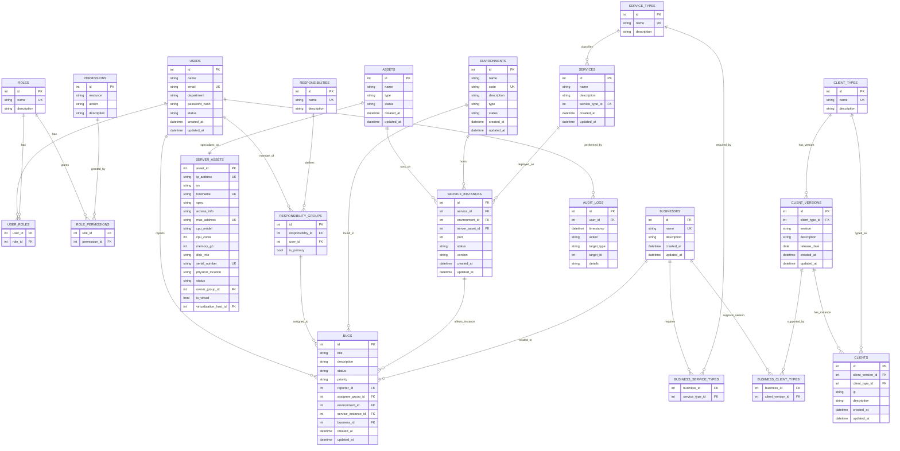

# 数据库设计

## 1. 数据库选型

*   **初步选择**: sqlite3
*   **理由**: 轻量级、易于部署、无需额外配置, 满足当前需求
*   **ORM/数据访问层**: 后端服务应使用 ORM 框架 (GORM) 。

## 2. 核心实体与关系 (Conceptual Model - 初步)



*   **用户 (Users)**: id, name, email, department, password_hash, status, created_at, updated_at
*   **角色 (Roles)**: id, name, description
*   **权限 (Permissions)**: id, resource, action (e.g., 'environment', 'read')
*   **用户角色关联 (UserRoles)**: user_id, role_id
*   **角色权限关联 (RolePermissions)**: role_id, permission_id
*   **职责 (Responsibilities)**: id, name, description
*   **职责组 (ResponsibilityGroups)**: id, responsibility_id, user_id, is_primary
*   **环境 (Environments)**: id, name, code, description, type, status, created_at, updated_at
*   **资产 (Assets)**: id, name, type (server, network_device), status, created_at, updated_at
*   **服务器资产 (ServerAssets)**: asset_id, ip_address, os, hostname, spec, access_info, mac_address, cpu_model, cpu_cores, memory_gb, disk_info, serial_number, physical_location, status, owner_group_id, is_virtual, virtualization_host_id
*   **服务类型 (ServiceTypes)**: id, name (e.g., 'API', 'Frontend', 'Database', 'Worker'), description
*   **服务 (Services)**: id, name, description, service_type_id, created_at, updated_at
*   **服务实例 (ServiceInstances)**: id, service_id, environment_id, server_asset_id, port, status, version
*   **业务 (Businesses)**: id, name, description, created_at, updated_at
*   **客户端类型 (ClientTypes)**: id, name (e.g., 'mac', 'win', 'android', 'ios', 'web', 'wechat'), description
*   **客户端版本 (ClientVersions)**: id, client_type_id, version, description, release_date, created_at, updated_at
*   **客户端 (Cliens)**: id, client_version_id, client_type_id, ip, description, release_date, created_at, updated_at
*   **业务服务类型关联 (BusinessServiceTypes)**: business_id, service_type_id
*   **业务客户端类型关联 (BusinessClientTypes)**: business_id, client_version_id
*   **配置 (Configurations)**: id, service_id/business_id, environment_id, key, value, version, description, created_at, updated_at
*   **Bug 报告 (Bugs)**: id, title, description, status, priority, reporter_id, assignee_group_id, environment_id, service_instance_id, business_id, created_at, updated_at
*   **审计日志 (AuditLogs)**: id, user_id, timestamp, action, target_type, target_id, details (JSON/Text)

*关系示例*:*   一个用户可以有多个角色 (`UserRoles`)。
*   一个角色可以有多个权限 (`RolePermissions`)。
*   一个职责组 `ResponsibilityGroups` 包含一个或多个用户，并关联到一个职责 `Responsibilities`。
*   环境 `Environments` 可以关联多个服务实例 `ServiceInstances` 和资产 `Assets` (通过中间表或外键)。
*   一个服务 `Services` 属于一种服务类型 `ServiceTypes`。
*   服务实例 `ServiceInstances` 关联服务 `Services`、环境 `Environments` 和服务器资产 `ServerAssets`。
*   一个业务 `Businesses` 可以依赖多种服务类型 `ServiceTypes` (`BusinessServiceTypes`)。
*   一个业务 `Businesses` 可以支持多种客户端应用 `ClientApplications` (`BusinessClientApplications`)。
*   一个客户端版本 `ClientVersions` 属于一个客户端应用 `ClientApplications` 且对应一个客户端类型 `ClientTypes`。
*   Bug `Bugs` 关联用户 (reporter), 职责组 (assignee), 环境, 服务实例, 业务等。

## 3. 核心表结构设计 (V1.0 关注点)

[根据 V1.0 计划 (`docs/requirements/execution_plan.md`)，优先设计以下核心表的详细结构]

*   `users`, `roles`, `user_roles` (支撑用户和基础权限)
*   `responsibilities`, `responsibility_groups` (支撑职责分配)
*   `environments`
*   `assets` (至少包含服务器类型的基础字段)
*   `server_assets`
*   `service_types`, `services`, `service_instances`
*   `businesses`
*   `client_types`, `client_versions`, `clients` 
*   `bugs` (包含核心关联字段)
*   关联表: `role_permissions` (假设权限表也需要基础定义), `business_service_types`, `business_client_types` (根据最新编辑)

**详细表结构定义:**

**`users`**
```sql
CREATE TABLE users (
    id INTEGER PRIMARY KEY AUTOINCREMENT,
    name TEXT NOT NULL,
    email TEXT NOT NULL UNIQUE,
    department TEXT,
    password_hash TEXT NOT NULL,
    status TEXT NOT NULL DEFAULT 'active', -- e.g., 'active', 'inactive', 'pending'
    created_at TEXT DEFAULT CURRENT_TIMESTAMP,
    updated_at TEXT DEFAULT CURRENT_TIMESTAMP
);
CREATE INDEX idx_users_email ON users(email);
CREATE INDEX idx_users_status ON users(status);
```

**`roles`**
```sql
CREATE TABLE roles (
    id INTEGER PRIMARY KEY AUTOINCREMENT,
    name TEXT NOT NULL UNIQUE,
    description TEXT
);
CREATE INDEX idx_roles_name ON roles(name);
```

**`permissions`** (假设需要基础定义以便关联)
```sql
CREATE TABLE permissions (
    id INTEGER PRIMARY KEY AUTOINCREMENT,
    resource TEXT NOT NULL, -- e.g., 'environment', 'service', 'bug'
    action TEXT NOT NULL, -- e.g., 'create', 'read', 'update', 'delete', 'assign'
    description TEXT,
    UNIQUE (resource, action)
);
CREATE INDEX idx_permissions_resource_action ON permissions(resource, action);
```

**`user_roles`** (关联表)
```sql
CREATE TABLE user_roles (
    user_id INTEGER NOT NULL,
    role_id INTEGER NOT NULL,
    PRIMARY KEY (user_id, role_id),
    FOREIGN KEY (user_id) REFERENCES users(id) ON DELETE CASCADE,
    FOREIGN KEY (role_id) REFERENCES roles(id) ON DELETE CASCADE
);
CREATE INDEX idx_user_roles_user_id ON user_roles(user_id);
CREATE INDEX idx_user_roles_role_id ON user_roles(role_id);
```

**`role_permissions`** (关联表)
```sql
CREATE TABLE role_permissions (
    role_id INTEGER NOT NULL,
    permission_id INTEGER NOT NULL,
    PRIMARY KEY (role_id, permission_id),
    FOREIGN KEY (role_id) REFERENCES roles(id) ON DELETE CASCADE,
    FOREIGN KEY (permission_id) REFERENCES permissions(id) ON DELETE CASCADE
);
CREATE INDEX idx_role_permissions_role_id ON role_permissions(role_id);
CREATE INDEX idx_role_permissions_permission_id ON role_permissions(permission_id);
```

**`responsibilities`**
```sql
CREATE TABLE responsibilities (
    id INTEGER PRIMARY KEY AUTOINCREMENT,
    name TEXT NOT NULL UNIQUE,
    description TEXT
);
CREATE INDEX idx_responsibilities_name ON responsibilities(name);
```

**`responsibility_groups`**
```sql
CREATE TABLE responsibility_groups (
    id INTEGER PRIMARY KEY AUTOINCREMENT,
    responsibility_id INTEGER NOT NULL,
    user_id INTEGER NOT NULL,
    is_primary INTEGER DEFAULT 0, -- 0 for false, 1 for true
    FOREIGN KEY (responsibility_id) REFERENCES responsibilities(id) ON DELETE CASCADE,
    FOREIGN KEY (user_id) REFERENCES users(id) ON DELETE CASCADE,
    UNIQUE (responsibility_id, user_id) -- 一个用户在一个职责下只能出现一次
);
CREATE INDEX idx_resp_groups_resp_id ON responsibility_groups(responsibility_id);
CREATE INDEX idx_resp_groups_user_id ON responsibility_groups(user_id);
```

**`environments`**
```sql
CREATE TABLE environments (
    id INTEGER PRIMARY KEY AUTOINCREMENT,
    name TEXT NOT NULL,
    code TEXT NOT NULL UNIQUE, -- e.g., 'prod', 'staging', 'dev'
    description TEXT,
    type TEXT, -- e.g., 'physical', 'cloud', 'hybrid'
    status TEXT NOT NULL DEFAULT 'active', -- e.g., 'active', 'maintenance', 'decommissioned'
    created_at TEXT DEFAULT CURRENT_TIMESTAMP,
    updated_at TEXT DEFAULT CURRENT_TIMESTAMP
);
CREATE INDEX idx_environments_code ON environments(code);
CREATE INDEX idx_environments_status ON environments(status);
```

**`assets`**
```sql
CREATE TABLE assets (
    id INTEGER PRIMARY KEY AUTOINCREMENT,
    name TEXT NOT NULL,
    type TEXT NOT NULL, -- 'server', 'network_device', etc.
    status TEXT NOT NULL DEFAULT 'in_use', -- e.g., 'in_use', 'in_stock', 'retired'
    created_at TEXT DEFAULT CURRENT_TIMESTAMP,
    updated_at TEXT DEFAULT CURRENT_TIMESTAMP
    -- Other common fields can be added here if applicable across types
);
CREATE INDEX idx_assets_type ON assets(type);
CREATE INDEX idx_assets_status ON assets(status);
```

**`server_assets`**
```sql
CREATE TABLE server_assets (
    asset_id INTEGER PRIMARY KEY, -- References assets.id
    ip_address TEXT UNIQUE,
    os TEXT,
    hostname TEXT UNIQUE,
    spec TEXT, -- Consider JSON for CPU, RAM, Disk
    access_info TEXT, -- Store reference/location, NOT secrets
    mac_address TEXT UNIQUE,
    cpu_model TEXT,
    cpu_cores INTEGER,
    memory_gb INTEGER,
    disk_info TEXT, -- Consider JSON
    serial_number TEXT UNIQUE,
    physical_location TEXT,
    status TEXT, -- More specific status if needed, else inherit from assets
    owner_group_id INTEGER, -- FK to responsibility_groups? Or just store group name? Needs clarification. Assuming FK for now.
    is_virtual INTEGER DEFAULT 0, -- 0 for false, 1 for true
    virtualization_host_id INTEGER, -- FK to assets.id (self-reference via assets)
    FOREIGN KEY (asset_id) REFERENCES assets(id) ON DELETE CASCADE,
    FOREIGN KEY (owner_group_id) REFERENCES responsibility_groups(id) ON DELETE SET NULL,
    FOREIGN KEY (virtualization_host_id) REFERENCES assets(id) ON DELETE SET NULL
);
-- Indices on frequently queried fields like hostname, ip_address, owner_group_id
CREATE INDEX idx_server_assets_ip ON server_assets(ip_address);
CREATE INDEX idx_server_assets_hostname ON server_assets(hostname);
CREATE INDEX idx_server_assets_owner ON server_assets(owner_group_id);
CREATE INDEX idx_server_assets_virt_host ON server_assets(virtualization_host_id);
```

**`service_types`**
```sql
CREATE TABLE service_types (
    id INTEGER PRIMARY KEY AUTOINCREMENT,
    name TEXT NOT NULL UNIQUE, -- e.g., 'API', 'Frontend', 'Database', 'Worker'
    description TEXT
);
CREATE INDEX idx_service_types_name ON service_types(name);
```

**`services`**
```sql
CREATE TABLE services (
    id INTEGER PRIMARY KEY AUTOINCREMENT,
    name TEXT NOT NULL,
    description TEXT,
    service_type_id INTEGER NOT NULL,
    created_at TEXT DEFAULT CURRENT_TIMESTAMP,
    updated_at TEXT DEFAULT CURRENT_TIMESTAMP,
    FOREIGN KEY (service_type_id) REFERENCES service_types(id) ON DELETE RESTRICT -- Prevent deleting type if services use it
);
CREATE INDEX idx_services_name ON services(name);
CREATE INDEX idx_services_type_id ON services(service_type_id);
```

**`service_instances`**
```sql
CREATE TABLE service_instances (
    id INTEGER PRIMARY KEY AUTOINCREMENT,
    service_id INTEGER NOT NULL,
    environment_id INTEGER NOT NULL,
    server_asset_id INTEGER NOT NULL, -- FK to assets.id, assuming instance runs on a server
    port INTEGER,
    status TEXT NOT NULL DEFAULT 'running', -- e.g., 'running', 'stopped', 'deploying', 'error'
    version TEXT, -- Version of the service deployed
    FOREIGN KEY (service_id) REFERENCES services(id) ON DELETE CASCADE,
    FOREIGN KEY (environment_id) REFERENCES environments(id) ON DELETE CASCADE,
    FOREIGN KEY (server_asset_id) REFERENCES assets(id) ON DELETE CASCADE -- Link to the asset (server)
);
CREATE INDEX idx_svc_inst_service_id ON service_instances(service_id);
CREATE INDEX idx_svc_inst_env_id ON service_instances(environment_id);
CREATE INDEX idx_svc_inst_asset_id ON service_instances(server_asset_id);
CREATE INDEX idx_svc_inst_status ON service_instances(status);
```

**`businesses`**
```sql
CREATE TABLE businesses (
    id INTEGER PRIMARY KEY AUTOINCREMENT,
    name TEXT NOT NULL UNIQUE,
    description TEXT,
    created_at TEXT DEFAULT CURRENT_TIMESTAMP,
    updated_at TEXT DEFAULT CURRENT_TIMESTAMP
);
CREATE INDEX idx_businesses_name ON businesses(name);
```

**`client_types`**
```sql
CREATE TABLE client_types (
    id INTEGER PRIMARY KEY AUTOINCREMENT,
    name TEXT NOT NULL UNIQUE, -- e.g., 'mac', 'win', 'android', 'ios', 'web', 'wechat'
    description TEXT
);
CREATE INDEX idx_client_types_name ON client_types(name);
```

**`client_versions`** (Based on user's latest structure, assuming this defines a releasable version)
```sql
CREATE TABLE client_versions (
    id INTEGER PRIMARY KEY AUTOINCREMENT,
    client_type_id INTEGER NOT NULL,
    version TEXT NOT NULL, -- e.g., '1.2.3', '20240717.1'
    description TEXT, -- Release notes or summary
    release_date TEXT, -- ISO8601 Format e.g., 'YYYY-MM-DD'
    created_at TEXT DEFAULT CURRENT_TIMESTAMP,
    updated_at TEXT DEFAULT CURRENT_TIMESTAMP,
    FOREIGN KEY (client_type_id) REFERENCES client_types(id) ON DELETE RESTRICT,
    UNIQUE (client_type_id, version) -- A version number should be unique per client type
);
CREATE INDEX idx_client_versions_type_id ON client_versions(client_type_id);
CREATE INDEX idx_client_versions_version ON client_versions(version);
```

**`clients`** (Based on user's `Cliens` table, representing an instance/installation?)
```sql
CREATE TABLE clients ( -- Renamed from Cliens
    id INTEGER PRIMARY KEY AUTOINCREMENT,
    client_version_id INTEGER NOT NULL,
    client_type_id INTEGER, -- Potentially redundant if derivable from client_version_id -> client_type_id
    ip TEXT, -- Represents instance IP?
    description TEXT,
    -- release_date TEXT, -- Redundant? Usually associated with version, not instance. Removed for clarity.
    created_at TEXT DEFAULT CURRENT_TIMESTAMP, -- Represents installation time?
    updated_at TEXT DEFAULT CURRENT_TIMESTAMP, -- Represents last update/check-in?
    FOREIGN KEY (client_version_id) REFERENCES client_versions(id) ON DELETE CASCADE,
    FOREIGN KEY (client_type_id) REFERENCES client_types(id) ON DELETE SET NULL -- Allow type FK to be nullable if redundant
);
CREATE INDEX idx_clients_version_id ON clients(client_version_id);
CREATE INDEX idx_clients_type_id ON clients(client_type_id);
CREATE INDEX idx_clients_ip ON clients(ip);
```
*Note: The purpose and exact fields of the `clients` table might need further clarification based on usage.*

**`business_service_types`** (关联表)
```sql
CREATE TABLE business_service_types (
    business_id INTEGER NOT NULL,
    service_type_id INTEGER NOT NULL,
    PRIMARY KEY (business_id, service_type_id),
    FOREIGN KEY (business_id) REFERENCES businesses(id) ON DELETE CASCADE,
    FOREIGN KEY (service_type_id) REFERENCES service_types(id) ON DELETE CASCADE
);
CREATE INDEX idx_biz_svc_types_biz_id ON business_service_types(business_id);
CREATE INDEX idx_biz_svc_types_type_id ON business_service_types(service_type_id);
```

**`business_client_types`** (关联表 - Based on user edit linking Business to Client Version)
```sql
CREATE TABLE business_client_types ( -- Name retained from user edit, but links Business to Client Version
    business_id INTEGER NOT NULL,
    client_version_id INTEGER NOT NULL, -- Links to a specific version per user edit
    PRIMARY KEY (business_id, client_version_id),
    FOREIGN KEY (business_id) REFERENCES businesses(id) ON DELETE CASCADE,
    FOREIGN KEY (client_version_id) REFERENCES client_versions(id) ON DELETE CASCADE
);
CREATE INDEX idx_biz_client_types_biz_id ON business_client_types(business_id);
CREATE INDEX idx_biz_client_types_ver_id ON business_client_types(client_version_id);
```
*Note: Linking a business directly to a client *version* is unusual. Consider if linking to `client_types` or a new `client_applications` table is more appropriate long-term.*

**`bugs`**
```sql
CREATE TABLE bugs (
    id INTEGER PRIMARY KEY AUTOINCREMENT,
    title TEXT NOT NULL,
    description TEXT,
    status TEXT NOT NULL DEFAULT 'new', -- e.g., 'new', 'assigned', 'in_progress', 'resolved', 'closed', 'reopened'
    priority TEXT DEFAULT 'medium', -- e.g., 'low', 'medium', 'high', 'critical'
    reporter_id INTEGER NOT NULL,
    assignee_group_id INTEGER, -- FK to responsibility_groups
    environment_id INTEGER, -- Optional: Where the bug was observed
    service_instance_id INTEGER, -- Optional: Specific instance affected
    business_id INTEGER, -- Optional: Related business area
    -- client_version_id INTEGER, -- Optional: If related to a specific client version
    created_at TEXT DEFAULT CURRENT_TIMESTAMP,
    updated_at TEXT DEFAULT CURRENT_TIMESTAMP,
    FOREIGN KEY (reporter_id) REFERENCES users(id) ON DELETE RESTRICT,
    FOREIGN KEY (assignee_group_id) REFERENCES responsibility_groups(id) ON DELETE SET NULL,
    FOREIGN KEY (environment_id) REFERENCES environments(id) ON DELETE SET NULL,
    FOREIGN KEY (service_instance_id) REFERENCES service_instances(id) ON DELETE SET NULL,
    FOREIGN KEY (business_id) REFERENCES businesses(id) ON DELETE SET NULL
    -- FOREIGN KEY (client_version_id) REFERENCES client_versions(id) ON DELETE SET NULL
);
CREATE INDEX idx_bugs_status ON bugs(status);
CREATE INDEX idx_bugs_priority ON bugs(priority);
CREATE INDEX idx_bugs_reporter_id ON bugs(reporter_id);
CREATE INDEX idx_bugs_assignee_group_id ON bugs(assignee_group_id);
CREATE INDEX idx_bugs_env_id ON bugs(environment_id);
CREATE INDEX idx_bugs_svc_inst_id ON bugs(service_instance_id);
CREATE INDEX idx_bugs_biz_id ON bugs(business_id);
```

## 4. 数据一致性与完整性

*   使用外键约束强制实体间的关联关系。
*   关键字段（如 email, 服务名+环境）考虑添加唯一约束。
*   使用数据库事务保证操作的原子性，特别是在涉及多个表更新的操作（如创建 Bug 时关联多个实体）。

## 5. 数据迁移

*   如果现有系统存在相关数据，需制定数据迁移计划（见 `requirements.md` 6.8）。可能需要编写迁移脚本。 